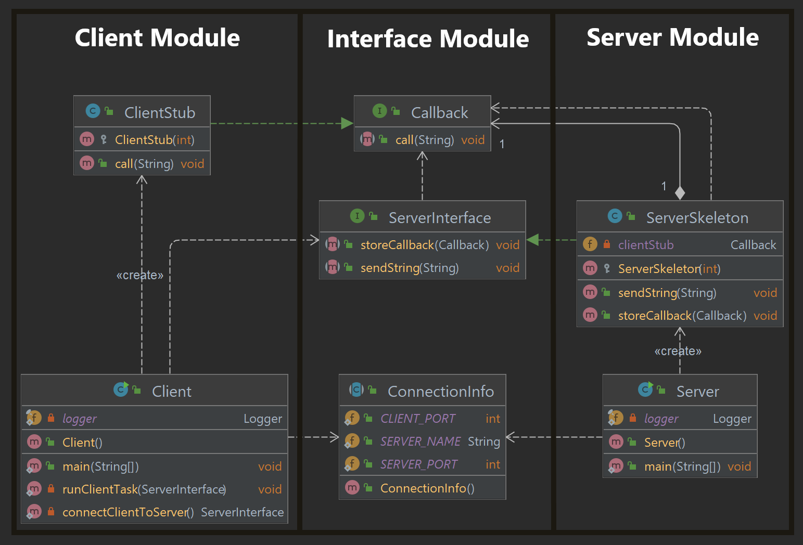
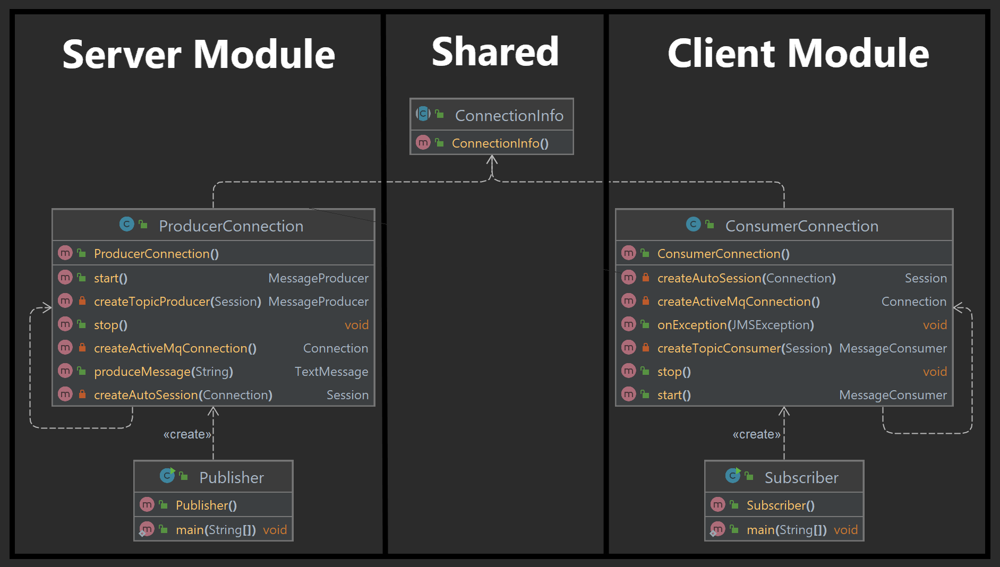
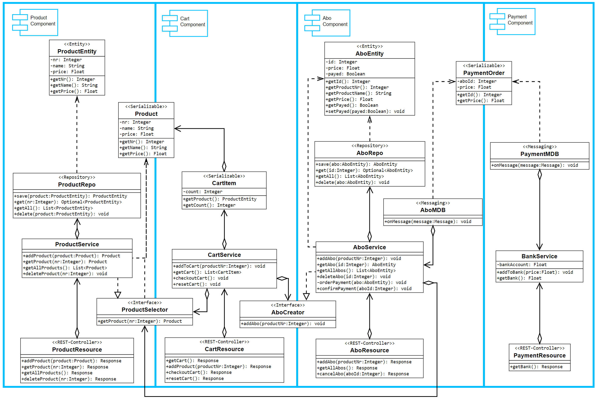
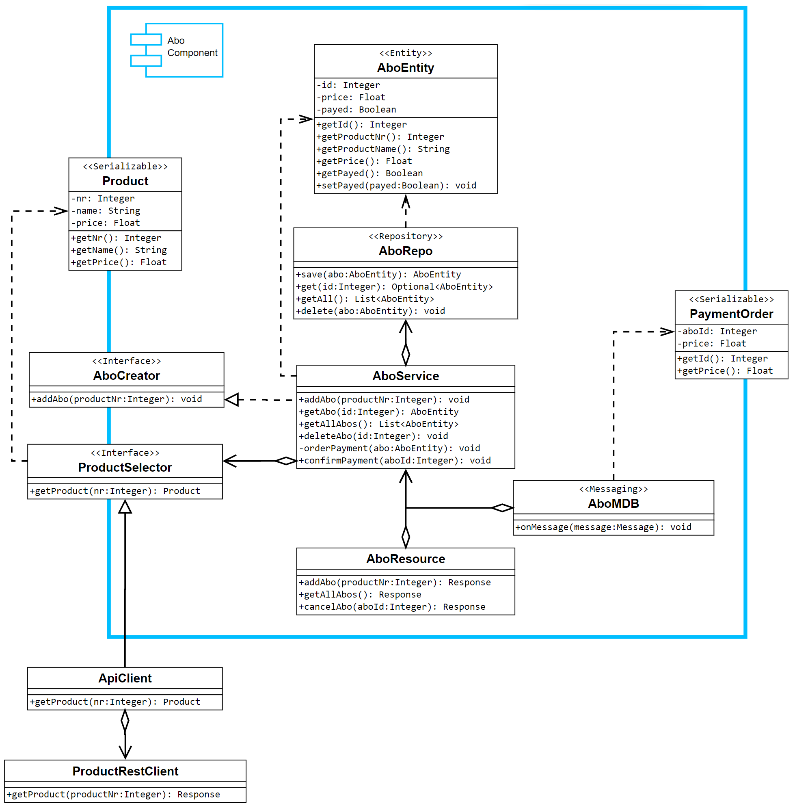

# Distributed System Demos

## 📂 [Java RMI](JavaRMI/src/main/java)

The [Server](JavaRMI/src/main/java/server_module/Server.java) provides a __skeleton__ with an
implemented [RMI Interface](JavaRMI/src/main/java/interface_module). This interface can be used from
the [Client](JavaRMI/src/main/java/client_module/Client.java). To use a bidirectional communication, the client provides
a __stub__ with the callback interface. With this stub the server can send its answer to the client.

__Note:__ Watch out for the extended classes, because they are the key for RMI.

<details>
  <summary>Class Diagram</summary>

__Note:__ Modules can be independent projects where the client and server each have the interface dependency.


</details>

<details>
  <summary>Usage and Output</summary>

1. Start [Server main()](JavaRMI/src/main/java/server_module/Server.java)
2. Start [Client main()](JavaRMI/src/main/java/client_module/Client.java)

__Server Output:__

```log
INFORMATION: Server is started!

Received message: Greetings from Client!
Received message: Greetings from Client!
Received message: Greetings from Client!
```

__Client Output:__

```log
Received callback: Client is registered for callback!
Received callback: Server received the message!
Received callback: Server received the message!
Received callback: Server received the message!
```

</details>

__System Requirements:__

* Java
* Maven

## 📂 [MQTT Controller](MqttController/src/main/java)

The controller show a small usage of the [Publisher](MqttController/src/main/java/server_module/Publisher.java) and
[Subscriber](MqttController/src/main/java/client_module/Subscriber.java) concept of MQTT. The communication goes over a
topic on a ActiveMQ Broker.

<details>
  <summary>Class Diagram</summary>

__Note:__ Modules can be independent projects.


</details>

<details>
  <summary>Usage and Output</summary>

1. Run `activemq start`
2. Start [Subscriber main()](MqttController/src/main/java/client_module/Subscriber.java)
3. Start [Publisher main()](MqttController/src/main/java/server_module/Publisher.java)

__Publisher Output:__

```log
Log Date Time server_module.ProducerConnection start
INFO: Started Connection.
Sent message: Hello! at: 1653930520109
Sent message: Hello! at: 1653930521130
Sent message: Hello! at: 1653930522132
Sent message: Hello! at: 1653930523147
Sent message: Hello! at: 1653930524159
Sent message: Hello! at: 1653930525170
Sent message: Hello! at: 1653930526177
Sent message: Hello! at: 1653930527186
Sent message: Hello! at: 1653930528190
Sent message: Hello! at: 1653930529191
Log Date Time server_module.ProducerConnection stop
INFO: Stopped Connection.
```

__Subscriber Output:__

```log
Log Date Time client_module.ConsumerConnection start
INFO: Started Connection.
Received: Hello! at: 1653930520109
Received: Hello! at: 1653930521130
Received: Hello! at: 1653930522132
Received: Hello! at: 1653930523147
Received: Hello! at: 1653930524159
Received: Hello! at: 1653930525170
Received: Hello! at: 1653930526177
Received: Hello! at: 1653930527186
Received: Hello! at: 1653930528190
Received: Hello! at: 1653930529191
Received: null
Log Date Time client_module.ConsumerConnection stop
INFO: Stopped Connection.
```

</details>

__System Requirements:__

* Java
* Maven
* ActiveMQ

## 📂 [Multi Threading](MultiThread_MonteCarlo/src/main/java/app)

A small example for multi threading is the calculation of Pi in the context of the __Monte Carlo__ problem. New issues
like __deadlocks and race conditions__ need to be addressed in manual multi threading.

<details>
  <summary>Usage and Output</summary>

1. Start [Application main()](MultiThread_MonteCarlo/src/main/java/app/Application.java)

__Note:__ The example was done with compromised processor configuration.

__Output:__

```log
INFO: Calculate 1.0E8 drops in circle.
INFO: Calculated pi: 3.1414568

Single thread result: 3.1414568
Single thread time: 7.5117718 seconds

INFO: Submitted job: 1
INFO: Submitted job: 2
INFO: Calculate 2.5E7 drops in circle.
INFO: Calculate 2.5E7 drops in circle.
INFO: Submitted job: 3
INFO: Submitted job: 4
INFO: Calculate 2.5E7 drops in circle.
INFO: Calculate 2.5E7 drops in circle.
INFO: Calculated pi: 3.14164704
INFO: Joined result: 1
INFO: Calculated pi: 3.14135488
INFO: Joined result: 2
INFO: Calculated pi: 3.14119488
INFO: Joined result: 3
INFO: Calculated pi: 3.14165968
INFO: Joined result: 4

Multi thread result: 3.14146412
Multi thread time: 36.5720642 seconds
```

</details>

__System Requirements:__

* Java
* Maven

## 📂 [REST API](REST_API/src/main/java/com/mono/api)

Monolithic REST API application with `Spring Boot`.

|               Table of Content                |
|:---------------------------------------------:|
|  [code](REST_API/src/main/java/com/mono/api)  |
| [configuration](REST_API/src/main/resources)  |
|       [dependencies](REST_API/pom.xml)        |
| [docker compose](REST_API/docker-compose.yml) |

<details>
  <summary>Class Diagram</summary>

__Note:__ Names might have changed.


</details>

<details>
  <summary>Usage</summary>

__Development:__

1. Provide the `MySQL-Server` and the `ActiveMQ-Broker` on the ports described in the configuration.
2. Run [ShopApplication main()](REST_API/src/main/java/com/mono/api/ShopApplication.java)
3. Open API Documentation on [http://localhost:8080/swagger-ui/](http://localhost:8080/swagger-ui/)

__Production:__

1. `cd ./REST_API`
2. `docker-compose up` (first start has sometimes race-conditions, with initial exceptions please restart again)
3. Open API Documentation on [http://localhost:8080/swagger-ui/](http://localhost:8080/swagger-ui/)

</details>

__System Requirements:__

* Java
* Maven
* ActiveMQ
* MySQL
* (Docker)

## 📂 [REST Microservices](REST_Microservices)

Microservices for an application with `Spring Boot`.
Transformed from the monolithic REST-API.
Service Modules are as independent as possible.

| Service                                                 | Code                                                                           | Configuration                                                          |
|:--------------------------------------------------------|:-------------------------------------------------------------------------------|:-----------------------------------------------------------------------|
| [Abo Module](REST_Microservices/AboService)             | [Abo Code](REST_Microservices/AboService/src/main/java/com/micro/api)         | [Abo Config](REST_Microservices/AboService/src/main/resources)         |
| [Cart Module](REST_Microservices/CartService)           | [Cart Code](REST_Microservices/CartService/src/main/java/com/micro/api)       | [Cart Config](REST_Microservices/CartService/src/main/resources)       |
| [Payment Module](REST_Microservices/PaymentService)     | [Payment Code](REST_Microservices/PaymentService/src/main/java/com/micro/api) | [Payment Config](REST_Microservices/PaymentService/src/main/resources) |
| [Product Module](REST_Microservices/ProductService)     | [Product Code](REST_Microservices/ProductService/src/main/java/com/micro/api) | [Product Config](REST_Microservices/ProductService/src/main/resources) |
| [API Gateway Module](REST_Microservices/ApiGateway)     | [API Gateway Code](REST_Microservices/ApiGateway/src/main/java/com/micro/api) | [API Gateway Config](REST_Microservices/ApiGateway/src/main/resources) |
| [docker compose](REST_Microservices/docker-compose.yml) |                                                                                |                                                                        |     

<details>
  <summary>Class Diagram</summary>

__Note:__ Diagram of only one service to display the pattern.


</details>

<details>
  <summary>Usage</summary>

1. Start Microservice Cluster with `docker-compose up`
2. Open Service API Documentations
    * [http://localhost:8080/product/swagger-ui/](http://localhost:8080/product/swagger-ui/)
    * [http://localhost:8080/cart/swagger-ui/](http://localhost:8080/cart/swagger-ui/)
    * [http://localhost:8080/abo/swagger-ui/](http://localhost:8080/abo/swagger-ui/)
    * [http://localhost:8080/payment/swagger-ui/](http://localhost:8080/payment/swagger-ui/)

</details>

__System Requirements:__

* Java
* Maven
* ActiveMQ
* MySQL
* Docker

## 📂 [REST Client UI](REST_Client_UI)

`Angular 13`-Frontend for all REST APIs. Make sure to set the correct `Backend-URL` in
the [environment](REST_Client_UI/src/environments).

|                        Angular                         |
|:------------------------------------------------------:|
|           [app root](REST_Client_UI/src/app)           |
| [backend connector](REST_Client_UI/src/app/connector)  |
|  [dependencies](REST_Client_UI/src/app/app.module.ts)  |
|        [dockerfile](REST_Client_UI/Dockerfile)         |

<details>
  <summary>Usage</summary>

__Development Server__:

Run `ng serve` for a dev server. Navigate to `http://localhost:4200/`. The app will automatically reload if you change
any of the source files.

__Docker Container__:

1. Run `docker build .`
2. Start docker container and open `http://localhost:4200/` in the browser.

</details>

__System Requirements:__

* NodeJS
* Docker

## 💾 System Requirements

### Java 11

1. Download: [Java 11+](https://www.oracle.com/java/technologies/javase/jdk11-archive-downloads.html)
2. Install the executable
3. Set [System Environment Variables](.readme-images/system-environment-guide.png):
4. New: `JAVA_HOME` = `C:\Program Files\Java\jdk-11`
5. Edit > `PATH` > New: `%JAVA_HOME%\bin`
6. Test command: `java -version`

### Maven

1. Download: [Maven 3.6.3+](https://maven.apache.org/download.cgi)
2. Unzip it to: `C:\Program Files\maven`
3. Set [System Environment Variables](.readme-images/system-environment-guide.png):
4. New: `MAVEN_HOME` = `C:\Program Files\maven`
5. Edit > `PATH` > New: `%MAVEN_HOME%\bin`
6. Test: `$ mvn -v`

### ActiveMQ

1. Download: [ActiveMQ 5.17+](https://activemq.apache.org/components/classic/download/)
2. Unzip it to: `C:\Program Files\activemq`
3. Set [System Environment Variables](.readme-images/system-environment-guide.png):
4. Edit > `PATH` > New: `C:\Program Files\activemq\bin`
5. Test command: `activemq start`
6. Admin page: [http://localhost:8161/admin](http://localhost:8161/admin) with `admin`, `admin` credentials.

### MySQL

1. Download: [MySQL 8 Server](https://dev.mysql.com/downloads/installer/)
2. Install the executable
3. Select `Server only`
4. Default `root` password: `password` (not for productive DB!)

### NodeJS

1. Download: [NodeJS](https://nodejs.org/en/)
2. Install the executable
3. Install the Angular CLI: `npm install -g @angular/cli@13.3.9`

### Docker

1. Download: [Docker Desktop](https://www.docker.com/products/docker-desktop)
2. Install the executable
