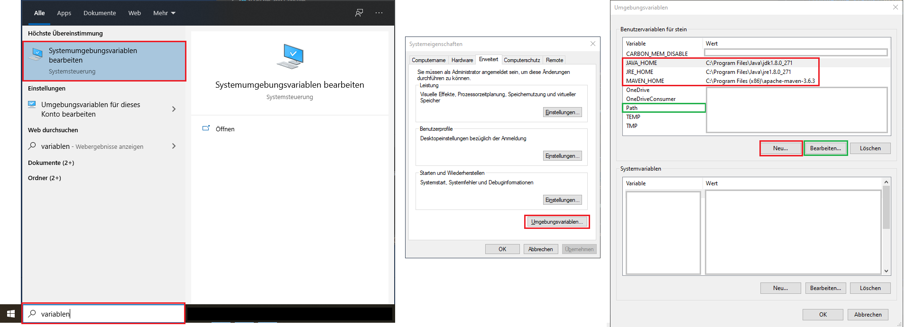
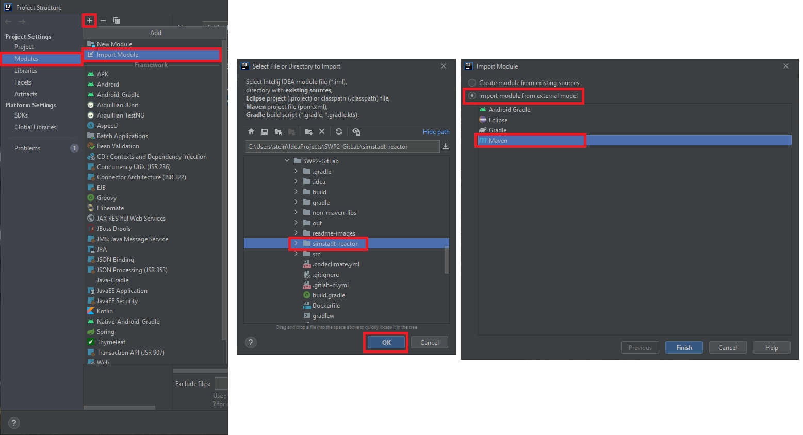

# Distributed Systems Templates

## [Java RMI](JavaRMI/src/main/java)

The [Server](JavaRMI/src/main/java/server/module/Server.java) provides a __skeleton__ with an
implemented [RMI Interface](JavaRMI/src/main/java/interfaces/module). This interface can be used from
the [Client](JavaRMI/src/main/java/client/module/Client.java). To use a bidirectional communication, the provides a __
stub__ with the callback interface. With this stub the server can send its answer to the client.

__Note:__ Watch out for the extended classes, because they are the key for RMI.

  
Class Diagram

__Note:__ Modules can be independent projects where the client and server each have the interface dependency.

## [MQTT Controller](MqttController/src/main/java/controller)

The controller show a small usage of the __publisher__ and __subscriber__ concept of MQTT. Real message driver behaviour
needs a lot more functionality like the implementation of the simple callback.

__Note:__ A really simple configuration is used.

## [Multi Threading](MultiThread_MonteCarlo/src/main/java/app)

A small example for multi threading is the calculation of Pi in the context of the __Monte Carlo__ problem. New issues
like __deadlocks and race conditions__ need to be addressed in manual multi threading.

## System Requirements

* Maven
* Java 11

### Maven - Installation:

1. Download: [Maven 3.6.3](https://downloads.apache.org/maven/maven-3/3.6.3/binaries/apache-maven-3.6.3-bin.zip)
2. Extract the __.zip__
3. Move the maven directory to `C:\Program Files (x86)\`
4. Set the __System Environment Variable__:
5. New: `MAVEN_HOME = C:\Program Files (x86)\apache-maven-3.6.3`
6. Edit > `PATH` > New: `%MAVEN_HOME%\bin`
7. Test: `$ mvn -v`

### Import of IntelliJ project structure:

1. IntelliJ > File > Project Structure > Modules > + > Import Module
2. Select 'project-sub-directory'
3. Import module from external model > Maven

