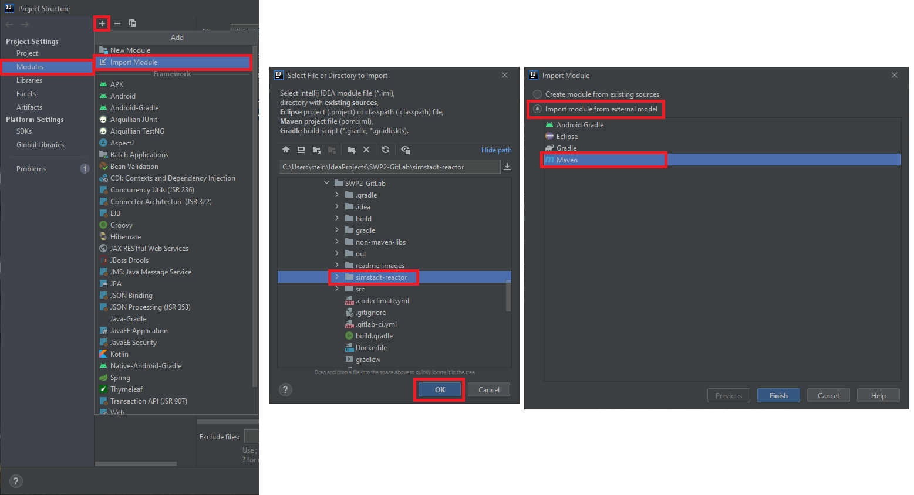

# Verteilte-Systeme-Prototypen

## System Bedingungen

* Das Java-Projekt ist auf Maven aufgebaut.
    * Java sollte installiert sein. (Vorgesehen ist 11+.)
    * Maven sollte installiert sein.
* Probleme könnte die Java-Version machen. Folgendes muss eventuell in der 'pom.xml' angepasst werden:
    
    
        < build >
            < plugins >
                < plugin >
                    < groupId>org.apache.maven.plugins</groupId >
                    < artifactId>maven-compiler-plugin</artifactId >
                    < configuration >
                        < source>11</source > <-- Diese Version muss eventuell angepasst werden.
                        < target>11</target > <-- Diese Version muss eventuell angepasst werden.
                    < /configuration >
                < /plugin >
            < /plugins >
        < /build >

## Entwicklungsumgebung für das Projekt:

### Maven - Installation:

1. Download: https://downloads.apache.org/maven/maven-3/3.6.3/binaries/apache-maven-3.6.3-bin.zip
2. Entpacke die .zip-Datei
3. Verschiebe den Maven-Ordner in den 'C:\Program Files (x86)\'-Ordner
4. Setze die Umgebungsvariablen in 'Systemumgebungsvariablen bearbeiten > Umgebungsvariablen':
5. Neu: 'MAVEN_HOME' = 'C:\Program Files (x86)\apache-maven-3.6.3'
6. Bearbeiten > 'PATH' > Neu: 'C:\Program Files (x86)\apache-maven-3.6.3\bin'
7. Test: Nutze cmd.exe: $ mvn -v

### Importieren der Projektstruktur in IntelliJ:

1. IntelliJ > File > Project Structure > Modules > + > Import Module
2. Select 'project-sub-directory'
3. Import module from external model > Maven

